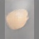
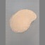
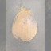

# Generative Adversarial Network – Mangos

Este proyecto implementa una Red Generativa Antagónica (GAN) utilizando TensorFlow para generar imágenes sintéticas de mangos. Se entrenó la red por múltiples épocas hasta lograr imágenes visualmente realistas.


##  Objetivo

Explorar el uso de redes generativas para la creación de imágenes sintéticas, enfocándose en un conjunto de imágenes de mangos.


## 🛠 Tecnologías

- Python 3.8+
- TensorFlow / Keras
- Matplotlib / NumPy

Instalar dependencias:
```bash
pip install -r requirements.txt
```


##  Cómo ejecutar

1. Abrir el notebook `gan-training.ipynb` en Jupyter.
2. Ejecutar las celdas para entrenar el generador y discriminador.
3. Ver las imágenes generadas en la carpeta `samples/`.


##  Resultados

Durante el entrenamiento se generaron imágenes sintéticas progresivamente más definidas, simulando mangos a partir de ruido aleatorio.

<div align="center">



</div>

##  Nota

Este proyecto fue realizado con fines educativos y de exploración de GANs.
